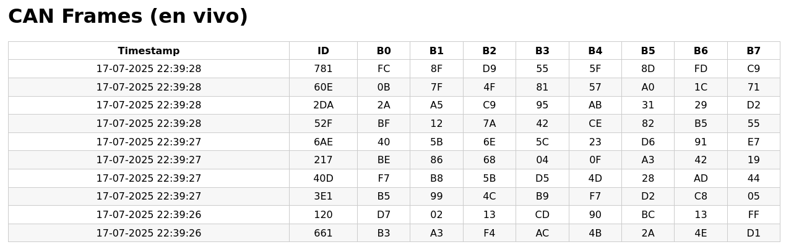

# LOG/UI de frames CAN en tiempo real 🚗⚡

## Desafío Técnico Eolian Auto Solar

1. **Recibir frames CAN** desde la terminal o generarlas aleatoriamente.  
2. **Transmitirlas por un FIFO** POSIX (`/tmp/frames.fifo`).  
3. **UI en una interfaz web** que muestra y actualiza los bytes apenas se modifica la fifo.

<p align="center">
  
</p>

---

## ✨ Características principales

| Módulo | Descripción |
|--------|-------------|
| **`can_writer` (C++20)** | - **Modo interactivo**: lee frames `id,b0..b7` desde `stdin`.<br> - **Modo aleatorio** `-r N` ms: genera frames con ID y bytes random cada *N* ms. |
| **Servidor Node + Socket.IO** | Lee el FIFO en streaming y envía cada línea a los navegadores conectados. |
| **Front‑end HTML + JS** | - Tabla con 10 columnas (timestamp, ID, 8 bytes)<br>- Si llega un frame con un **ID ya existente**: se sobrescriben solo los bytes cambiados y destellan 0,5 s.<br>- Hasta 10 filas, modo FIFO visual. |

---

## 🛠️ Requisitos

| Software | Versión mínima | Uso |
|----------|----------------|-----|
| **g++**  | 12 (C++20)     | Compilar `can_writer`. |
| **make** | —              | Conveniencia. |
| **Node.js** | 18 LTS      | Servidor + dependencias NPM. |
| **npm**  | 9 o superior   | Instalación de paquetes. |
| **POSIX FIFO** | —        | El proyecto crea `/tmp/frames.fifo` automáticamente. |

*(Probado en Debian 12)*

---

## 📦 Instalación

```bash
# 1) Clona el repo
git clone https://github.com/cadaeic628/eolian-technical-challenge.git
cd eolian-technical-challenge

# 2) Compila el productor C++
make            # genera ./can_writer

# 3) Instala dependencias del servidor
cd web
npm install     # instala express y socket.io

